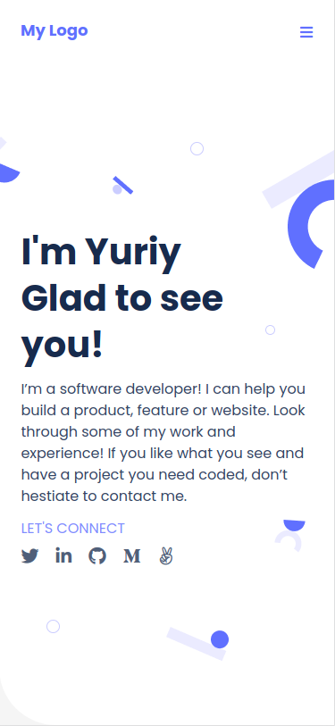

# Yuriy Chamkoriyski's Microverse Portfolio

> Portfolio web site, showcasing my projects while studying at Microverse.

## Project list

I will be building my website portfolio during the first module of the program. Here is the list of projects that will guide me. I will find details about each of the projects requirements in the upcoming program activities. In some of the projects I will be working individually, but in others I will be working collaboratively with my coding partner.

- [x] Project 1: Setup and mobile version skeleton
- [x] Project 2: Mobile version
- [x] Project 3: Contact form (pair programming)
- [x] Project 4: Desktop version
- [x] Project 5: Application deploy
- [x] Project 6: Evaluate accessibility (pair programming)
- [x] Project 7: Mobile menu (pair programming)
- [x] Project 8: Details modal (pair programming)
- [x] Project 9: Validate contact form (pair programming)
- [ ] Project 10: Preserve data in the browser (pair programming)

## Built With

- Major languages: HTML, CSS
- Frameworks: none
- Technologies used: GitHub, Lighthouse, Webhint, Stylelint

## Live Demo

You can view the current deployment by clicking the link bellow:

[Live Demo Link](https://hombre2014.github.io/My-portfolio/)

## Getting Started

**Simply open the link above.**

To get a local copy up and running follow these simple example steps.

### Prerequisites

- Internet connection and a web browser

### Setup

- No setup required

### Install

- No installation required

### Usage

- Enter the URL address (https://hombre2014.github.io/My-portfolio/) in your web browser

### Run tests

- Lighthouse, Webhint, Stylelint

### Deployment

- Using GitHub Pages

## Author

👤 **Yuriy Chamkoriyski**

- GitHub: [@Hombre](https://github.com/Hombre)
- Twitter: [@Chamkoriyski](https://twitter.com/Chamkoriyski)
- LinkedIn: [axebit](https://linkedin.com/in/axebit)

## 🤝 Contributing

Contributions, issues, and feature requests are welcome!

Feel free to check the [issues page](https://github.com/Hombre/My-portfolio/issues).

## Show your support

Give a ⭐️ if you like this project!

## Acknowledgments

Thanks to [@gemmen29](https://github.com/gemmen29) George Magdy's contribution in the third part of the project.

Thanks to [@nevisende](https://github.com/nevisende) Furkan Denizhan's contribution in mobile menu JS part of the project.

## 📝 License

This project is [MIT](./MIT.md) licensed.
